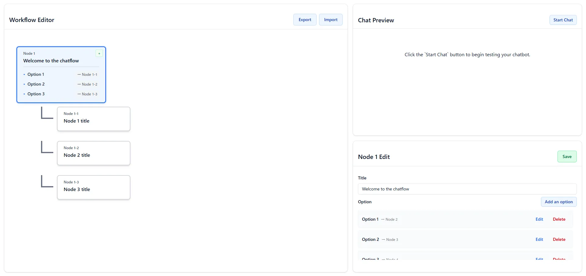

# Chatbot Flow Editor

**Visual development tool for creating chatbot conversation flows**

A visual development tool that opens in your browser. Design, test, and export chatbot conversation flows with ease.

## 🚀 Quick Start

```bash
# Install as development dependency
npm install --save-dev chatbot-flow-editor

# Launch the editor
npx chatbot-flow-editor
```

Your browser will automatically open with the visual flow editor.

## 📦 Installation & Usage

### Method 1: Using npx (Recommended)
```bash
npm install --save-dev chatbot-flow-editor
npx chatbot-flow-editor
```

### Method 2: Add to your project scripts
Add to your `package.json`:
```json
{
  "scripts": {
    "chatbot-editor": "chatbot-flow-editor"
  }
}
```

Then run:
```bash
npm run chatbot-editor
```

### Method 3: Global installation
```bash
npm install -g chatbot-flow-editor
chatbot-flow-editor
```

## 🖥️ Usage

### Starting the Editor
```bash
# Default (opens on http://localhost:4001)
chatbot-flow-editor

# Custom port
PORT=4000 chatbot-flow-editor
```

### Available Commands
```bash
chatbot-flow-editor start    # Start the editor (default)
chatbot-flow-editor help     # Show help
chatbot-flow-editor version  # Show version
```

## 🎯 How to Use

1. **🚀 Launch**: Run `npx chatbot-flow-editor`
2. **➕ Create Nodes**: Click "Add Node" to create conversation points
3. **✏️ Edit Content**: Click any node to modify its content and options
4. **🧪 Test Flow**: Use the chat preview to simulate user interactions
5. **💾 Save Work**: Export your flows as JSON files
6. **📂 Load Flows**: Import existing JSON flows to continue editing

## 🔧 Development Workflow

```bash
# In your chatbot project directory
npm install --save-dev chatbot-flow-editor

# Design your conversation flows
npx chatbot-flow-editor

# Export the flow as JSON
# → Use the exported JSON in your chatbot application
```

## 📁 Project Structure

When you export a flow, you'll get a JSON structure like:

```json
[
  {
    "id": 1,
    "title": "Welcome to our support!",
    "options": [
      { "label": "Technical Support", "nextId": 2 },
      { "label": "Billing Questions", "nextId": 3 }
    ]
  }
]
```

## 🛠️ Integration Examples

### Using with Popular Chatbot Frameworks

**Microsoft Bot Framework:**
```javascript
// Load your exported flow
const flow = require('./chatbot-flow.json')

// Use in your bot logic
const currentNode = flow.find(n => n.id === currentNodeId)
await context.sendActivity(currentNode.title)
```

## 🎨 Screenshots



## 🔄 Workflow

1. **Design Phase**: Use the visual editor to create conversation flows
2. **Test Phase**: Try different conversation paths with the live preview  
3. **Export Phase**: Download your flow as structured JSON
4. **Integration Phase**: Use the JSON in your chatbot application

## 📋 Requirements

- Node.js 18.0.0 or higher
- Modern web browser
- 10MB free disk space

```bash
git clone https://github.com/enumura1/chatbot-flow-editor.git
cd chatbot-flow-editor
npm install
npm run dev
```

## 📄 License

This project is licensed under the **MIT License**.
See the [LICENSE](./LICENSE) file for details.

## Support

- 📖 [Documentation](https://github.com/enumura1/chatbot-flow-editor)
- 🐛 [Report Issues](https://github.com/enumura1/chatbot-flow-editor/issues)
- 💬 [Discussions](https://github.com/enumura1/chatbot-flow-editor/discussions)

---
